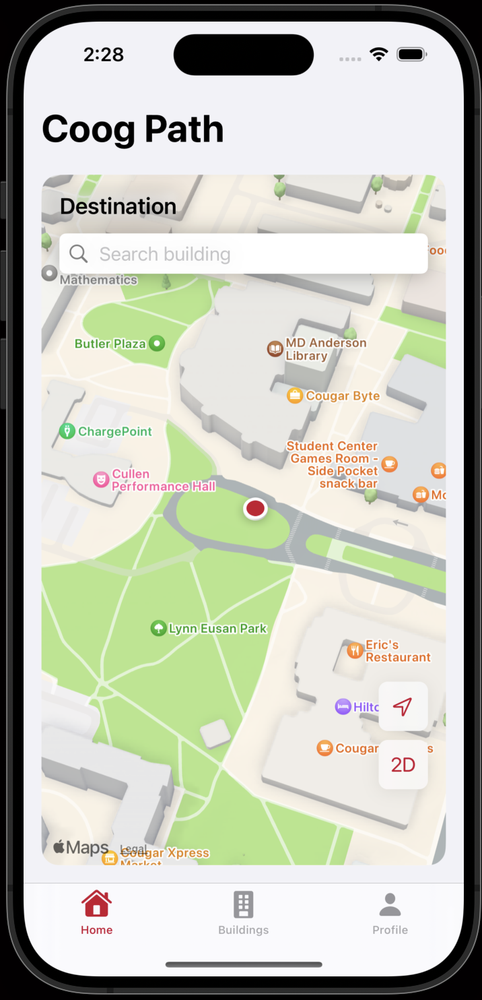
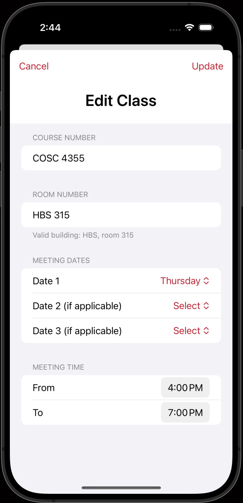
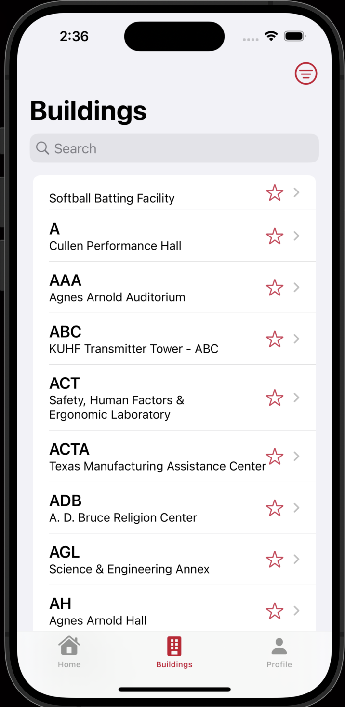
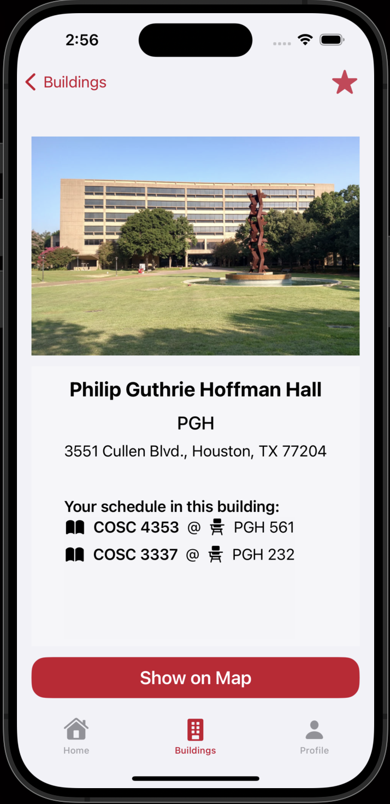

# UH-Fall2023 COSC4355: Ubiquitous Computing

## Team 8:

- Minh Nguyen
- Duc Duong

<h1 align="center"> Coog-Path</h1>

 An iOS app that helps UH students navigate to buildings easier

## Setup Instruction:

**_Preferably working with this project on macOS_**

1. Requirements:

- Xcode >= 15 with iOS 17 installed
- Git

2. Clone the repository: `git clone https://github.com/ndminhvn/Coog-Path`
3. Open the project with Xcode (or double-click `Coog Path.xcodeproj`)
4. Build the project

## Features:

### First Launch Screen

    
    

### Home Tab

    
    

    
    

    
    

### Profile Tab

    
    

    
    

    
    

### Building Tab

    
    

    
    

